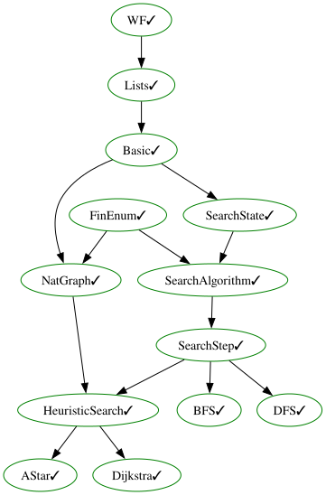

# Graph Search and Planning in Lean

We define various graph search algorithms:

- DFS
- BFS
- Dijksta
- A*

And prove their correctness.

Our main result is that the H1 heuristic is admissible.
## Seven implementations of heuristic search

The heuristic search (A* / Dijkstra) exists in seven interchangeable implementations, which
are *proved* to compute the same path.  Only the data structures differ.

| implementation | file | expansion | state |
|---|---|---|---|
| reference | `HeuristicSearch.lean`, `AStar.lean`, `Dijkstra.lean` | enumerates all vertices | `Finset` + closures |
| generator | `HeuristicSearchGen.lean`, `AStarGen.lean`, `DijkstraGen.lean`, `MultigoalGen.lean` | neighbour list | `Finset` + closures |
| flattened  | `HeuristicSearchMap.lean`, `AStarMap.lean`, `DijkstraMap.lean`, `MultigoalMap.lean` | neighbour list | `Finset` + `Std.HashMap` |
| fast | `HeuristicSearchFast.lean`, `AStarFast.lean`, `DijkstraFast.lean`, `MultigoalFast.lean` | neighbour list | `Finset` + `Std.HashSet` + `Std.HashMap` |
| sorted | `HeuristicSearchSorted.lean`, `AStarSorted.lean`, `DijkstraSorted.lean`, `MultigoalSorted.lean` | neighbour list | as above + maintained sorted queue with multiplicities |
| heap | `LeftistHeap.lean`, `HeapQueue.lean`, `HeuristicSearchHeap.lean`, `AStarHeap.lean`, `DijkstraHeap.lean`, `MultigoalHeap.lean` | neighbour list | as above, but the queue is a leftist heap instead of a sorted list |
| lazy heap | `StaleQueue.lean`, `HeapLazyState.lean`, `HeuristicSearchHeapLazy.lean`, `HeapLazyQueue.lean`, `HeapLazyStep.lean`, `AStarHeapLazy.lean`, `DijkstraHeapLazy.lean`, `MultigoalHeapLazy.lean` | neighbour list | as above, but a heap with *lazy deletion*: a decrease-key inserts a new entry instead of rebuilding the queue |

Two further improvements apply to all of them and change no statement: the linear-time path
reconstruction (`ExtractPathFast.lean`, `SearchExeFast.lean`, `AStarHeapLazyPath.lean`, …) and
the **cached heuristic** (`LazyMemo.lean`, `HeuristicCache.lean`, `AStarCached.lean`), each
described in its own section below.

### Why the flattened version

In the reference state, `pathOrder : V → D` and `mother : visited → V` are *functions*, and
every expansion builds the new ones as closures around the previous ones.  After `k`
expansions a single lookup therefore walks a chain of `k` closures (each performing an
adjacency decision and a `Finset` membership test), and evaluating that chain re-evaluates
earlier layers repeatedly.  The cost of an expansion grows quickly with the number of steps
already performed.

`HeuristicSearchMap.lean` keeps the same information *flattened*: `orderMap : Std.HashMap V
(ℕ × ℕ)` and `motherMap : Std.HashMap V V`, each with a default value for untouched vertices.
A lookup is one hash-map access, independent of the number of steps performed.

### How correctness is transferred

Nothing is re-proved.  The flattened state becomes a `WeightedDiGraph.has_base_search_state`
through an abstraction function `toBaseState`, and

* `NatGraph.hsearch_step_expand_map_eq` shows that after **every expansion the abstract search
  state is literally the same**, no matter how it is encoded;
* `WeightedDiGraph.search_exe_with_stack_step_sim` (in `SearchSim.lean`) is a generic transfer
  theorem: two implementations of the search that differ only in *how* the state is
  represented return the same path.

Together they give `astar_map_eq`, `dijkstra_map_eq` and `astar_multigoal_map_eq`, from which
soundness, completeness and optimality of the flattened algorithms follow immediately.

### Measured effect

`lake exe bench` (Experiments 5–7) compares the two.  On a non-branching path graph with
`|V| = 4096` and the goal at increasing depth (= number of expansions):

| goal depth | `dijkstra_gen` | `dijkstra_map` |
|-----------:|---------------:|---------------:|
|         20 |         1.3 ms |         1.5 ms |
|         40 |          12 ms |         1.9 ms |
|         80 |         100 ms |          12 ms |
|        160 |         960 ms |          34 ms |
|        320 |       12 400 ms |         242 ms |

Experiment 6 prints the wall-clock time of *each individual expansion*: for the closure-based
state it grows from ≈ 55 µs to ≈ 10 ms over 150 steps, while the flattened state stays around
200 µs.  (The search itself is a pure function and cannot read the clock; the experiment
therefore drives the verified `search_stack_step` one expansion at a time from `IO` and takes
a timestamp around each step.)

### Why the fast and the sorted version

Two costs remained in the flattened implementation, and both grow with the size of the search
rather than with the out-degree:

* **the visited set.**  Accumulating a `Finset` with `s ∪ [v].toFinset` is `Θ(|s|)` per
  insertion (and the membership tests are linear as well), so a search of `n` steps pays
  `Θ(n²)` — measurably the dominant cost.  `HeuristicSearchFast.lean` therefore stores a
  `VisitedSet`: the `Finset` the correctness statements talk about, paired with a
  `Std.HashSet` holding the same elements (a `Prop` field records that they agree, and is
  erased by the compiler).  Insertion uses `Finset.cons`, membership uses the hash set; both
  are `O(1)`.
* **the queue.**  The reference expansion recomputes `(stackTail ++ newly).mergeSort cmp`
  after *every* expansion and tests `v ∉ stackTail` by scanning the queue once per neighbour,
  i.e. `Θ(m log m)` for a queue of length `m`.  `HeuristicSearchSorted.lean` keeps the queue
  sorted (its sortedness is a `Prop` field of the state) and merges the new nodes into it —
  which by `SortAux.mergeSort_append_of_pairwise_left` yields *the same list* — falling back
  to a full sort only when a queued node's order actually changed.  Queue membership is a
  lookup in a hash map of multiplicities, which is another `Prop`-certified field.

Correctness is transferred exactly as for the flattened version, through
`NatGraph.hsearch_step_expand_fast_eq` and `NatGraph.hsearch_step_expand_sorted_eq` (the
latter with the generic transfer theorem `search_exe_with_stack_step_sim_of_stack` of
`SearchSimStack.lean`, whose hypothesis is only that the step is applied to the queue of its
own state — which is how the search loop calls it).

#### Measured effect

`lake exe bench` on the path graph (`|V| = 4096`, goal at increasing depth):

| goal depth | `dijkstra_map` | `dijkstra_fast` | `dijkstra_sorted` |
|-----------:|---------------:|----------------:|------------------:|
|        320 |         8.2 ms |          0.6 ms |            0.3 ms |
|       1280 |          626 ms |          7.2 ms |            4.1 ms |
|       2560 |         6634 ms |         15.8 ms |           20.7 ms |

`lake exe benchbroom` on a graph whose first expansion fills the queue with `|V| - 1` nodes
(so the queue, not the visited set, is what grows):

| `|V|` | `dijkstra_fast` | `dijkstra_sorted` |
|------:|----------------:|------------------:|
|   500 |           60 ms |            2.2 ms |
|  1000 |          269 ms |            2.4 ms |
|  2000 |         1335 ms |            2.6 ms |

The per-expansion time of both the fast and the sorted state is flat (≈ 0.5 µs per expansion
over 3000 expansions on the path graph; `lake exe bench` prints it).  What is left of the
super-linear end-to-end behaviour on the path graph is the *path extraction* at the very end
of the search (`WeightedDiGraph.extract_path_to` appends with `Walk.concat`, which is
quadratic in the length of the returned path); it is a one-off cost, not a per-expansion one.

#### Very large graphs with a very large queue (`lake exe benchhuge`)

`BenchHuge` scales the large-queue experiment up to **10 million** vertices (raw output in
`bench-results-huge.txt`; `BenchHuge.lean` documents the setup).

*Broom graph* (`0 → v` for all `v ≠ 0`): one expansion fills the queue with `|V| - 1` nodes,
then the whole queue is drained one pop at a time.

| `|V|`  | `dijkstra_sorted`, queue drained | goal popped first | RSS |
|-------:|---------------------------------:|------------------:|----:|
| 10⁴    | 13 ms                            | —                 | 93 MiB |
| 10⁵    | 207 ms                           | —                 | 119 MiB |
| 10⁶    | 2.25 s                           | 2.03 s            | 380 MiB |
| 10⁷    | 22.4 s                           | 22.0 s            | 3.1 GiB |

(Times vary by ≈ ± 20 % between runs.)  The time is linear in `|V|` (2.2 µs per queued node at
every size), and the comparison of the
two time columns shows where it is spent: a run that stops after the *first* pop is just as
expensive, so almost all of it is the single expansion that *creates* the 10⁷ queue entries,
while the 10⁷ pops from the 10-million-element queue together account for at most ≈ 1.5 s.

*Binary tree* (`i → 2i+1, 2i+2`, edge costs `(v % 5) + 1`): the queue keeps growing and is
written to in every expansion.

| `|V|`  | `dijkstra_sorted` | per expansion |
|-------:|------------------:|--------------:|
| 5000   | 0.22 s            | 45 µs |
| 10000  | 0.92 s            | 92 µs |
| 20000  | 3.85 s            | 192 µs |
| 40000  | 16.0 s            | 401 µs |

This is the regime the *heap* implementation removes: with the queue represented as a sorted
*list*, inserting a node costs `O(position)`, and the children of the popped node land far
inside the queue.

### Why the heap version

`SearchAlgorithms/LeftistHeap.lean` defines a leftist heap `LHeap` with `merge`, `insert`,
`peek` and `deleteMin`, and `SearchAlgorithms/HeapQueue.lean` relates a heap to the sorted
list it represents: `HeapQueue.toQueue cmp h` pops the heap completely, and
`HeapQueue.toQueue_eq` says that this is `mergeSort cmp` of the heap's elements whenever the
comparator is transitive and total.  Sorting is therefore never performed during the search —
the sorted queue exists only in the *specification*, as the list the heap would produce.

The state of `SearchAlgorithms/HeuristicSearchHeap.lean` is that of the fast implementation
with the queue replaced by a `LHeap (V × ℕ)`: each entry carries a sequence number, so that
the heap can break ties exactly the way `mergeSort` does (`List.zipIdxLE`), which is what
makes the queue order — and hence the returned path — literally the same list. An expansion
pops the heap once and inserts each newly reachable node (`O(log m)` each); only when the
expansion changes the path order of a node that is *still queued* is the heap rebuilt from
the sorted list, the same rare fallback as in the sorted implementation.

Correctness is again transferred rather than re-proved: `NatGraph.hsearch_heap_step_eq` says
that one heap step is the corresponding reference step under the abstraction map, and
`NatGraph.astar_heap_eq`, `NatGraph.dijkstra_heap_eq`,
`NatGraph.astar_multigoal_heap_eq` conclude that the searches return the same path;
soundness, completeness and optimality (`NatGraph.astar_heap_is_optimal`) follow.

#### Heap versus sorted list (`lake exe benchheap`, full output in `bench-results-heap.txt`)

Binary tree `i → 2i+1, 2i+2`, i.e. the queue grows throughout the search:

| `|V|`  | `dijkstra_sorted` | `dijkstra_heap` |
|-------:|------------------:|----------------:|
| 10000  | 977 ms            | 35 ms |
| 20000  | 4229 ms           | 92 ms |
| 40000  | 16659 ms          | 202 ms |
| 160000 | (not run)         | 1732 ms |

The sorted list is quadratic here (0.10 → 0.42 ms per expansion), the heap stays at
3.5 – 11 µs per expansion.

The heap is not uniformly better.  On the *broom* graph, where the queue is filled once and
then drained in order, the sorted list never pays for an insertion in the middle, while the
heap pays a `merge` per pop:

| `|V|`   | `dijkstra_sorted` | `dijkstra_heap` |
|--------:|------------------:|----------------:|
| 100000  | 217 ms            | 1040 ms |
| 1000000 | 2389 ms           | 18007 ms |

So the sorted implementation remains the better choice for searches whose queue is built once,
and the heap implementation for searches whose queue is written to repeatedly — which is the
usual case.

Two things dominated the per-expansion cost while this was tuned, and both are visible in the
source of `hsearch_expand_heap_core`:

* `Std.HashMap` is only updated in place while it is *uniquely referenced*.  The expansion
  therefore reads every field of the old state (including the single read of the old order
  map needed by the rebuild test) into `let`s *before* the first `insert`; otherwise every
  expansion copies the whole map.  On the 160000-vertex tree this alone was the difference
  between 63 s and 2.4 s.
* The comparator is called `O(log m)` times per heap operation, so `hsearch_heap_le_fast`
  computes the `f`-value of each argument once instead of up to four times.  It is
  *definitionally* equal to `hsearch_heap_le` (`hsearch_heap_le_fast_eq` is `rfl`), so no
  proof changes.

### Why the lazily deleted heap

One expensive case is left in the heap implementation: when an expansion improves the path
order of a node that is *still in the queue* (a **decrease-key** — which is what Dijkstra's
relaxation does), the comparison function changes, the heap invariant may break and the queue
has to be rebuilt, `Θ(m log m)` for a queue of `m` nodes.

`SearchAlgorithms/HeapLazyState.lean` removes that case.  Every heap entry is a triple
`((v, key), n)`: the vertex, **the path order it had when the entry was created**, and the
number of the insertion.  The comparison reads the *stored* key and therefore never changes,
so no update of the path-order map can break the heap.  A decrease-key simply inserts a new
entry (`O(log m)`) and leaves the old one behind as a **stale** entry; `queued : Std.HashMap
V ℕ` records the number of the current entry of each queued vertex, so an entry is live iff
`queued[v] = n`, and stale entries are dropped when they arrive at the root
(`HeapQueue.purge`, `O(log m)` amortised, at most once per entry).  Every expansion is
therefore `O(deg · log m)`, whatever the path orders do.

The queue represented by such a state is `HeapQueue.liveQueue`, the entries in queue order
with the stale ones removed, and the core lemma `HeapQueue.liveQueue_eq`
(`SearchAlgorithms/StaleQueue.lean`) says that this is the **stable sort** of the live
entries: the stale entries are invisible.  Reproducing the tie-breaking of `List.mergeSort`
is the delicate point, and `hsearch_lazy_D_ref_tie` is where it is proved: a re-inserted node
gets a *fresh* number, so it sorts after every node it is now tied with (correct, because a
node it ties with after the decrease had a strictly smaller `f`-value before), and several
nodes re-inserted by the same expansion are inserted in queue order.

Correctness is transferred, not re-proved: `NatGraph.hsearch_step_expand_lazy_eq` shows that
after every expansion the abstract state is the reference state,
`NatGraph.hsearch_lazy_step_eq` lifts this to one step of the search loop, and
`NatGraph.astar_heap_lazy_eq`, `NatGraph.dijkstra_heap_lazy_eq`,
`NatGraph.astar_multigoal_heap_lazy_eq` conclude that the searches return the same path;
soundness, completeness and optimality (`NatGraph.astar_heap_lazy_is_optimal`) follow.
`astar_heap_lazy_eq_heap` and `astar_heap_lazy_eq_gen` relate it to the other
implementations.

#### Measured effect (`lake exe benchlazy`, full output in `bench-results-lazy.txt`)

The *chain-broom* is the extreme case: vertex `0` is connected to every other vertex (cost
`5v`) and `i` to `i + 1` (cost `1`), so the first expansion fills the queue with `|V| - 1`
nodes and **every** later expansion is a decrease-key on that queue.

| `|V|` | `dijkstra_sorted` | `dijkstra_heap` | `dijkstra_heap_lazy` |
|------:|------------------:|----------------:|---------------------:|
| 2000  | 1524 ms           | 6283 ms         | 21 ms |
| 4000  | —                 | 30858 ms        | 109 ms |
| 16000 | —                 | —               | 900 ms |

Where no decrease-key happens (binary tree) or the queue stays small (grid), the two heap
implementations are within noise of each other — 3–4 µs per expansion on the grid, 7–10 µs on
the tree — so the lazy book-keeping costs nothing measurable when it does not pay off.

The one thing that dominated the per-expansion cost while this was tuned is the same as for
the eagerly updated heap, one level up: a `Std.HashMap` is updated in place only while it is
uniquely referenced, and *the state object holds a reference to each of its maps*.  The
expansion must therefore let the old state die before it touches any of them: it reads the
fields into `let`s, computes the per-neighbour data with `hsearch_lazy_itemsOf` (which takes
the fields, not the state), and reports the size of the *new* visited set in the progress
line rather than the old one.  Keeping the old state alive across the expansion — through a
single further read of one of its fields — made every expansion copy every map and cost a
factor of 8 on the binary tree (73 µs → 8.7 µs per expansion at `|V| = 40000`).

#### What the chain-broom totals do *not* measure: path reconstruction

The totals above are wall-clock times for the whole call, and on the chain-broom most of that
time is not the search.  `lake exe benchlazy chaintrace n every` (and `flattrace n every` for
the control without decrease-keys) prints a progress line every `every` expansions;
timestamping those lines splits the run into the start-up, the expansions and everything that
happens after the last expansion:

| graph, `|V|` | start-up + first 1000 | expansions | µs/expansion | after the search |
|-------------:|----------------------:|-----------:|-------------:|-----------------:|
| chain 8000   |                394 ms |      11 ms |          1.4 |           184 ms |
| chain 16000  |                292 ms |      65 ms |          4.0 |           666 ms |
| chain 32000  |                390 ms |     177 ms |          5.5 |          2846 ms |
| flat  8000   |                362 ms |      40 ms |          5.0 |             4 ms |
| flat  16000  |                467 ms |      97 ms |          6.1 |             5 ms |
| flat  32000  |                697 ms |     309 ms |          9.6 |             4 ms |

The expansions cost a few microseconds each and do not get slower as the search proceeds,
with or without decrease-keys.  The seconds are spent **after** the last expansion, in
`WeightedDiGraph.extract_path_to`: it rebuilds the path from the mother pointers by appending
one edge at the *end* of the path built so far (`Walk.concat`, i.e. `Walk.append` of the
whole prefix), which is `Θ(L²)` for a path with `L` edges.  The chain-broom's answer is the
whole chain `0 → 1 → ⋯ → n-1`, so `L = |V| - 1`, and the 184 / 666 / 2846 ms grow by a factor
of four per doubling.  The `chainflat` and `split` controls are cheap here only because their
answer is a path of one resp. two edges.

This quadratic reconstruction is shared by *every* implementation in this library and is
independent of the queue representation.  It is fixed by the linear reconstruction described
next.

### Timestamping the progress lines

The progress lines are printed from inside a *pure* function (`dbg_trace`, wrapped in
`traceIf`, which is proved to be the identity), so they cannot carry a wall-clock time of
their own — reading the clock is an effect, and the searches would no longer be the pure
functions all the correctness proofs are about.  Timestamping is therefore done outside, on
the stderr stream, which gives the same information:

```sh
lake exe benchlazy chaintrace 32000 1000 2>&1 |
  while IFS= read -r l; do printf '%s %s\n' "$(date +%s.%N)" "$l"; done
```

The differences between consecutive timestamps are the cost of the last `every` expansions;
this is how the per-phase tables above were measured.

## Linear-time path reconstruction

`WeightedDiGraph.extract_path_to` walks from the goal back to the start along the mother
pointers and appends every edge at the *end* of the path built so far, so a path with `L`
edges costs `Θ(L²)`.  `SearchAlgorithms/ExtractPathFast.lean` does the same walk but grows
the answer at its *front* (`Walk.cons`, `O(1)` per step) by carrying the part already built
as an accumulator:

* `extract_walk_fast_eq` — the accumulator version computes `extract_path_to … .append acc`;
* `extract_path_fast`, `extract_path_fast_eq` — started at the goal with the empty
  accumulator it therefore returns *literally* the path of `extract_path_to`.  The `Nodup`
  proof of the returned `Path` is taken from that equation, so nothing is recomputed at run
  time.

`SearchAlgorithms/SearchExeFast.lean` plugs this into the three search drivers
(`search_exe_fast`, `search_exe_with_stack_step_fast`, `search_exe_with_step_eq_fast`), each
with an equation saying that it returns the same `Option (Path start goal)` as the driver it
replaces.  The searches themselves are unchanged; only the reconstruction differs:

| search | file |
|---|---|
| `astar_heap_lazy_fastpath`, `dijkstra_heap_lazy_fastpath`, `astar_multigoal_heap_lazy_fastpath`, `dijkstra_multigoal_heap_lazy_fastpath` | `AStarHeapLazyPath.lean` |
| `astar_sorted_fastpath`, `dijkstra_sorted_fastpath`, `astar_multigoal_sorted_fastpath`, `dijkstra_multigoal_sorted_fastpath` | `AStarSortedPath.lean` |
| `dijkstra_all_extract_path_fast` (a shortest path to one node, read off the exhausted all-nodes state) | `DijkstraAllNodesPath.lean` |

As everywhere else in this library, correctness is transferred rather than re-proved:
`astar_heap_lazy_fastpath_eq_lazy` / `astar_sorted_fastpath_eq_sorted` give equality with the
search they replace, hence with `astar`, and soundness, completeness and optimality follow.

### Measured effect (`lake exe benchpath`, full output in `bench-results-path.txt`)

Wall-clock time of the whole call (search **and** reconstruction), Dijkstra with the lazily
deleted heap, on graphs whose answer runs through every vertex (`L = |V| - 1`):

| graph, `|V|` | `extract_path_to` | `extract_path_fast` |
|-------------:|------------------:|--------------------:|
| path  8000   |            171 ms |               10 ms |
| path  16000  |            625 ms |               18 ms |
| path  32000  |           3063 ms |               69 ms |
| chain 8000   |            274 ms |              130 ms |
| chain 16000  |            921 ms |              158 ms |
| chain 32000  |           3270 ms |              332 ms |

The old reconstruction quadruples per doubling; the new one doubles.  On the chain-broom the
remaining time is the search itself (the queue holds `|V| - i` nodes), on the plain path it
is start-up plus the linear reconstruction.  The same holds for the sorted queue (plain path,
`|V| = 32000`: 3006 ms → 56 ms).  At sizes the old reconstruction could not reach, the new
one stays linear: plain path 64000 / 128000 / 256000 in 105 / 267 / 537 ms, chain-broom in
0.7 / 1.4 / 3.8 s.

## Caching the heuristic

The heuristic is a **pure function of the vertex**: `heur v` cannot change during a search, so
it only ever needs to be computed once.  A search calls it far more often than that:

* once per neighbour of every expanded node (the test `heur v ≠ ⊤`), and
* twice per comparison in the queue — and a heap operation performs `O(log m)` comparisons, so
  one expansion costs `Θ(deg · log m)` heuristic evaluations.

On a 6×6 grid, an uncached A\* evaluates the heuristic **361** times; with a cache it is
evaluated **35** times — once for each vertex the search looks at
(`lake exe benchcache count 6 0`).  When the heuristic is expensive (a pattern database, a
relaxed sub-search, distances to landmarks) that factor is the run time of the search.

`SearchAlgorithms/LazyMemo.lean` and `SearchAlgorithms/HeuristicCache.lean` provide a cache
that is *pure*, evaluates the function **at most once per argument**, and never evaluates it
at all for an argument that is not looked up.  It is built from `Thunk`s — Lean's lazy values,
which store the result of the first force — arranged in one of three shapes:

| cache | create | lookup | memory | measured (`lake exe benchmemo`) |
|---|---|---|---|---|
| `CachedFun.ofArray n vi f` | `O(n)` thunks | `O(1)` | one cell per vertex | 24 ns |
| `CachedFun.ofChunked c k vi f` | `O(k)` | two array indexings | one cell per vertex of the *touched* chunks | 36 ns |
| `CachedFun.ofWTrie vi d f` | `O(1)` | one step per 4 bits of the vertex number | only the vertices looked up | 175 ns |
| `CachedFun.ofTrie vi d f` | `O(1)` | one step per bit | only the vertices looked up | 330 ns |

`vi : VIndex V` is an injective numbering of the vertices with a partial inverse
(`VIndex.ofFin`, `VIndex.ofNat`, `VIndex.ofFinEnum`, `VIndex.option`).

### Correctness is transferred, not re-proved

A `CachedFun f` carries the proof `fn_eq : fn = f`: **the cache is the function it caches**
(`trieLookup_eq`, `wtrieLookup_eq`, `arrayLookup_eq` — no bound on the depth or the size is
needed, a lookup that misses simply recomputes).  A search with a cached heuristic is
therefore literally the same function as the search with `heur`, and every statement follows
by rewriting with that equation.  `SearchAlgorithms/AStarCached.lean` gives

* `astar_heap_lazy_fastpath_cached` (and `astar_multigoal_heap_lazy_fastpath_cached`) — the
  fastest search in the library with a cached heuristic, plus the convenience entry points
  `astar_heap_lazy_chunked`, `astar_heap_lazy_wtrie`, `astar_heap_lazy_trie` and
  `astar_heap_lazy_array`, which build the cache themselves;
* `astar_heap_lazy_fastpath_cached_eq`, `astar_heap_lazy_wtrie_eq`, … — the returned path is
  the one of `astar`, and hence soundness, completeness and optimality
  (`…_cached_is_optimal`) hold unchanged.

```lean
-- vertices are `Fin n`, so `Fin.val` numbers them; chunks of 1024
#eval astar_heap_lazy_chunked G (VIndex.ofFin n) heur 1024 (n / 1024 + 1) start goal

-- or share one cache between several searches:
let hc := CachedFun.ofChunked 1024 (n / 1024 + 1) (VIndex.ofFin n) heur
astar_heap_lazy_fastpath_cached G hc start goal
```

### Measured effect (`lake exe benchcache`, full output in `bench-results-cache.txt`)

A\* on the `n × n` grid, Manhattan heuristic plus `work` iterations of arithmetic that stand
in for a real, expensive heuristic.  Wall-clock time of the whole search:

| grid, `work` | uncached | binary trie | 16-way trie | chunked | array |
|---|---:|---:|---:|---:|---:|
| 100×100, `work` = 0 | 32 ms | 127 ms | 102 ms | 44 ms | 38 ms |
| 100×100, `work` = 50 | 252 ms | 133 ms | 118 ms | 44 ms | 43 ms |
| 100×100, `work` = 500 | 2205 ms | 192 ms | 205 ms | 101 ms | 95 ms |
| 50×50, `work` = 500 | 388 ms | 38 ms | 58 ms | 28 ms | 30 ms |

So: with an expensive heuristic the cache is worth an order of magnitude (2205 ms → 95 ms),
and the more expensive the heuristic the closer the cached search gets to the cost of
evaluating it exactly once per vertex.  With a *cheap* heuristic a cache can cost more than it
saves — the array and the chunked cache are almost free, the tries are not — so cache what is
expensive, and prefer `ofChunked` (or `ofArray` if one cell per vertex can be afforded), which
keeps the lookup at the cost of two array indexings while still allocating only for the part
of the graph the search touches.

## Dependency Graph



(Update this graph with `make dependencies.svg`.)
